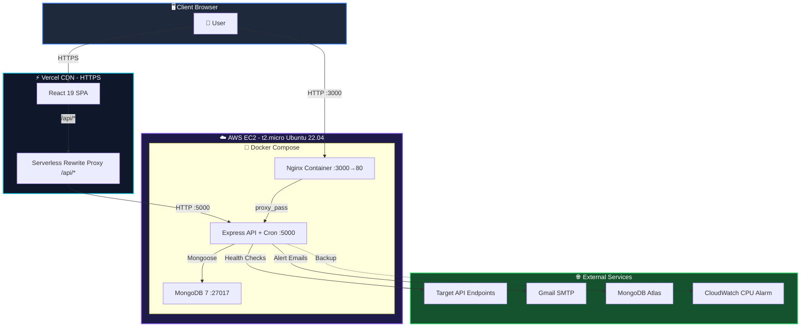
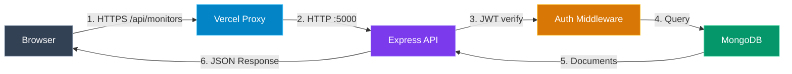
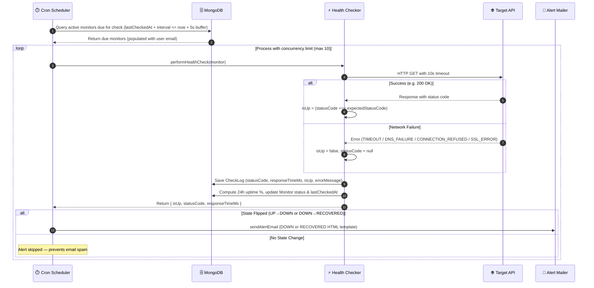
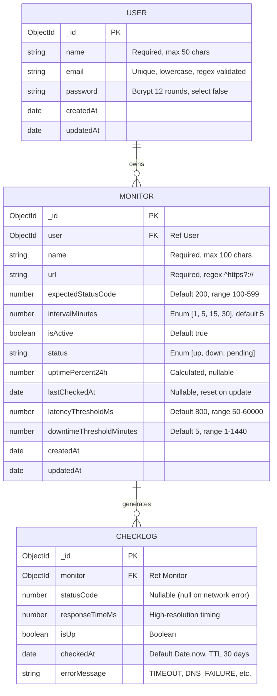
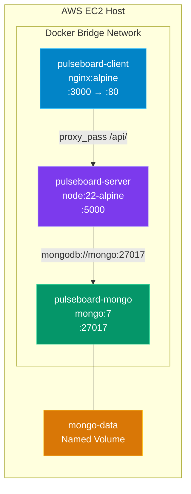
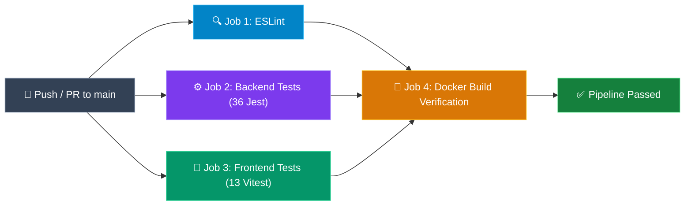
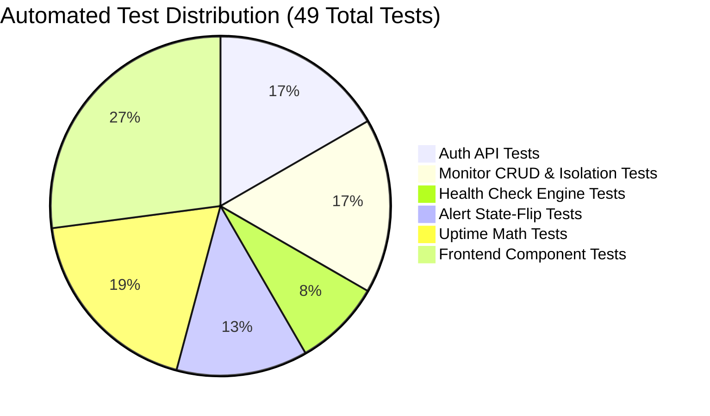

<div align="center">

# 🚀 Pulseboard — Real-Time API Health & Uptime Monitoring System

A production-grade, full-stack MERN application for real-time API uptime monitoring, response latency tracking, threshold violation detection, and automated incident email alerting — deployed on AWS EC2 and Vercel.

[](https://github.com/sherlock-hashed/Shakti/actions/workflows/ci.yml)


[Live Demo](https://shakti-liard.vercel.app) · [GitHub](https://github.com/sherlock-hashed/Shakti) · [API Health](http://34.228.14.119:5000/api/health)

</div>

---

## 📑 Table of Contents

- [Problem Statement](#-problem-statement)
- [Features](#-features)
- [Live Deployments](#-live-deployments)
- [Tech Stack](#️-tech-stack)
- [Project Structure](#-project-structure)
- [Installation & Setup](#-installation--setup)
- [System Architecture (HLD)](#-system-architecture-hld)
- [Low-Level Design (LLD)](#-low-level-design-lld)
- [Database Documentation](#️-database-documentation)
- [API Documentation](#-api-documentation)
- [Docker Configuration](#-docker-configuration)
- [Nginx Configuration](#-nginx-configuration)
- [AWS Infrastructure](#️-aws-infrastructure)
- [CI/CD Pipeline](#-cicd-pipeline-github-actions)
- [Testing Documentation](#-testing-documentation)
- [Performance & Reliability](#-performance--reliability)
- [Configuration Documentation](#️-configuration-documentation)
- [Known Limitations](#️-known-limitations)
- [License](#-license)

---

## 🎯 Problem Statement

Modern web applications rely on multiple APIs and microservices. When an API endpoint silently goes down, teams often discover the outage from customer complaints rather than proactive detection.

**Pulseboard solves this by:**
- Automatically executing background HTTP health checks on user-defined endpoints at configurable intervals (1, 5, 15, or 30 minutes)
- Measuring response latency in milliseconds using high-resolution timers (`performance.now()`)
- Categorizing network failures into actionable error types (`TIMEOUT`, `DNS_FAILURE`, `CONNECTION_REFUSED`, `SSL_ERROR`)
- Computing 24-hour rolling uptime percentages from historical check logs
- Sending instant HTML email alerts via Nodemailer **only when service status actually changes** (UP → DOWN or DOWN → RECOVERED), preventing inbox spam

---

## ✨ Features

| Category | Feature | Details |
|---|---|---|
| **Monitoring** | Background Health Checks | `node-cron` scheduler runs every minute, checking due monitors via HTTP GET with 10s timeout |
| **Monitoring** | Configurable Intervals | Choose from 1, 5, 15, or 30-minute check frequencies per monitor |
| **Monitoring** | Expected Status Code | Define the expected HTTP status (100–599) — marks DOWN if response differs |
| **Monitoring** | Error Categorization | Classifies failures as `TIMEOUT`, `DNS_FAILURE`, `CONNECTION_REFUSED`, `CONNECTION_RESET`, or `SSL_ERROR` |
| **Metrics** | 24-Hour Rolling Uptime | Computes uptime percentage from all checks in the last 24 hours, updated after every health check |
| **Metrics** | Response Time Tracking | High-resolution `performance.now()` timing displayed in interactive Recharts line graphs |
| **Metrics** | Latency Threshold Alerts | Configurable latency threshold (50–60,000 ms) with visual warnings when exceeded |
| **Alerts** | State-Change Email Alerts | Nodemailer sends HTML emails **only** on UP→DOWN or DOWN→RECOVERED transitions — no spam |
| **Dashboard** | Search & Filter | Real-time search by name/URL, filter by status (UP / DOWN / ALL) |
| **Dashboard** | Bulk Actions | Select multiple monitors for bulk pause, resume, or delete operations |
| **Dashboard** | CSV & PDF Export | Client-side export of monitor lists and check logs via `jsPDF` and `jspdf-autotable` |
| **Dashboard** | Dark / Light Theme | Toggle between themes with `localStorage` persistence |
| **Auth** | JWT Authentication | Secure registration and login with 12-round bcrypt hashing and 7-day JWT tokens |
| **Auth** | Cross-User Privacy | Compound unique indexes ensure users can only access their own monitors |
| **Infrastructure** | Docker Compose | 3-container orchestration (Nginx + Express + MongoDB) with multi-stage builds |
| **Infrastructure** | Nginx Reverse Proxy | SPA routing fallback, API proxying, 1-year static asset caching, dotfile blocking |
| **Infrastructure** | AWS EC2 Deployment | Production hosting on `t2.micro` Ubuntu 22.04 with IAM + CloudWatch monitoring |
| **Infrastructure** | Vercel CDN + HTTPS Proxy | Frontend hosted on Vercel; serverless rewrites proxy `/api/*` to EC2 (solves Mixed Content) |
| **CI/CD** | GitHub Actions Pipeline | 4-job automated pipeline: ESLint → Jest (36) → Vitest (13) → Docker Build verification |
| **Data** | 30-Day Auto Log Cleanup | MongoDB TTL index on `CheckLog.checkedAt` auto-deletes logs older than 30 days |
| **Data** | Cascading Deletes | Deleting a monitor removes all associated check logs |

---

## 🌐 Live Deployments

| Environment | URL |
|---|---|
| **Frontend** (Vercel CDN) | [https://shakti-liard.vercel.app](https://shakti-liard.vercel.app) |
| **Backend API** (AWS EC2) | `http://34.228.14.119:5000/api` |
| **Health Check** | `http://34.228.14.119:5000/api/health` |
| **Source Code** | [github.com/sherlock-hashed/Shakti](https://github.com/sherlock-hashed/Shakti) |

---

## 🛠️ Tech Stack

| Layer | Technology | Purpose |
|---|---|---|
| **Frontend** | React 19 · TypeScript · Vite | Component-based SPA with static typing and fast HMR |
| **Styling** | Tailwind CSS v4 · Radix UI · Recharts | Utility-first CSS, accessible UI primitives, interactive charts |
| **Backend** | Node.js 22 · Express 5 | REST API with async error handling |
| **Database** | MongoDB 7 · Mongoose ODM | Document store with schema validation and TTL indexes |
| **Auth** | JWT · bcryptjs | 7-day Bearer tokens, 12-round password hashing |
| **Scheduler** | node-cron | Background health check worker (1-minute sweeps) |
| **Alerts** | Nodemailer (Gmail SMTP) | HTML email alerts on status state changes |
| **Containers** | Docker · Docker Compose · Nginx | Multi-stage builds, 3-container orchestration, reverse proxy |
| **Cloud** | AWS EC2 · IAM · CloudWatch | Production hosting, least-privilege access, CPU alarm monitoring |
| **CDN** | Vercel | Frontend hosting with serverless API proxy rewrites |
| **CI/CD** | GitHub Actions | 4-job pipeline (lint, backend tests, frontend tests, Docker build) |
| **Testing** | Jest · Vitest · Testing Library | 36 backend + 13 frontend = 49 automated tests |

---

## 📁 Project Structure

```
pulseboard/
├── .github/
│   └── workflows/
│       └── ci.yml                        # GitHub Actions CI/CD pipeline
│
├── client/                               # React 19 + TypeScript SPA
│   ├── public/
│   │   ├── favicon.svg                   # Pulse logo SVG favicon
│   │   └── favicon.ico                   # Classic favicon
│   ├── src/
│   │   ├── api/
│   │   │   ├── axiosInstance.ts          # Axios client, token injection, 401 interceptor
│   │   │   └── monitorApi.ts            # Typed API service (list, get, create, update, delete)
│   │   ├── components/
│   │   │   ├── landing/                 # PublicNavbar, Hero, Features, HowItWorks, StatsStrip, FinalCta, Footer
│   │   │   ├── layout/                  # Navbar, ProtectedRoute
│   │   │   ├── monitors/               # MonitorCard, StatusBadge, ResponseTimeChart, RecentChecksTable
│   │   │   │                           # AddEditMonitorModal, AlertReportsModal
│   │   │   ├── ui/                     # Radix-based primitives (Button, Card, Dialog, Input, etc.)
│   │   │   └── theme-toggle.tsx        # Dark/light mode toggle
│   │   ├── context/
│   │   │   └── AuthContext.tsx          # Auth provider (login, register, logout, token persistence)
│   │   ├── hooks/
│   │   │   └── useMonitors.ts           # Polling hook (20s interval)
│   │   ├── lib/
│   │   │   ├── theme.tsx                # Theme context with localStorage persistence
│   │   │   ├── format.ts               # Relative time formatter (12s ago, 5 min ago)
│   │   │   ├── exportMonitors.ts       # CSV & PDF monitor list exporter
│   │   │   ├── exportChecks.ts         # CSV & PDF check log exporter
│   │   │   └── utils.ts                # Tailwind class merge (cn utility)
│   │   ├── pages/
│   │   │   ├── Landing.tsx             # Public marketing homepage
│   │   │   ├── Login.tsx               # Login page + AuthShell + FieldWithIcon
│   │   │   ├── Register.tsx            # Registration page
│   │   │   ├── Dashboard.tsx           # Main monitoring dashboard (search, filter, bulk actions, export)
│   │   │   ├── MonitorDetail.tsx       # Single monitor view (charts, check logs, thresholds)
│   │   │   └── NotFound.tsx            # 404 page
│   │   ├── App.tsx                     # React Router route definitions
│   │   └── main.tsx                    # Application entrypoint
│   ├── tests/
│   │   ├── setup.ts                    # Vitest setup (polyfills for Radix UI in jsdom)
│   │   ├── Dashboard.test.tsx          # 5 tests
│   │   ├── Login.test.tsx              # 4 tests
│   │   └── AddEditMonitorModal.test.tsx # 4 tests
│   ├── Dockerfile                      # Multi-stage Nginx build
│   ├── nginx.conf                      # Reverse proxy & SPA routing
│   ├── vercel.json                     # Vercel API proxy rewrites
│   ├── vite.config.ts                  # Vite + Vitest configuration
│   ├── tsconfig.json
│   └── package.json
│
├── server/                              # Express 5 REST API + Cron Engine
│   ├── src/
│   │   ├── config/
│   │   │   └── db.js                   # MongoDB connection handler
│   │   ├── controllers/
│   │   │   ├── authController.js       # register, login, getMe
│   │   │   └── monitorController.js    # CRUD + duplicate validation + cascading delete
│   │   ├── cron/
│   │   │   └── scheduler.js            # node-cron worker (1m sweeps, 10-request concurrency, 5s buffer)
│   │   ├── middleware/
│   │   │   └── auth.js                 # JWT Bearer token verification
│   │   ├── models/
│   │   │   ├── User.js                 # User schema (bcrypt pre-save hook, 12-round salt)
│   │   │   ├── Monitor.js              # Monitor schema (compound unique indexes per user)
│   │   │   └── CheckLog.js             # CheckLog schema (30-day TTL auto-cleanup)
│   │   ├── routes/
│   │   │   ├── authRoutes.js           # /api/auth/* endpoints
│   │   │   └── monitorRoutes.js        # /api/monitors/* endpoints (all protected)
│   │   ├── utils/
│   │   │   ├── jwt.js                  # Token sign (7d expiry) & verify helpers
│   │   │   ├── performHealthCheck.js   # HTTP checker (10s timeout, error categorization, uptime calc)
│   │   │   ├── sendAlertEmail.js       # Nodemailer HTML alert email templates (DOWN/RECOVERED)
│   │   │   └── calculateUptime.js      # Uptime percentage math (2-decimal rounding)
│   │   ├── app.js                      # Express app setup (CORS, routes, error handler)
│   │   └── server.js                   # Entry point (DB connect, scheduler start, listen)
│   ├── tests/
│   │   ├── setup.js                    # MongoMemoryServer test infrastructure
│   │   ├── auth.test.js                # 8 tests
│   │   ├── monitors.test.js            # 8 tests (includes cross-user isolation)
│   │   ├── healthCheck.test.js         # 4 tests (nock HTTP mocking)
│   │   ├── alert.test.js               # 6 tests (state-flip logic)
│   │   └── uptime.test.js             # 9 tests (math edge cases)
│   ├── Dockerfile                      # Multi-stage build with non-root user (appuser)
│   ├── .dockerignore
│   ├── jest.config.js
│   └── package.json
│
├── docs/
│   ├── EC2_BACKEND_DEPLOYMENT_GUIDE.md       # AWS EC2 setup & Docker deployment
│   ├── VERCEL_FRONTEND_DEPLOYMENT_GUIDE.md   # Vercel setup & HTTPS proxy config
│   └── AWS_IAM_CLOUDWATCH_SETUP.md           # IAM policy & CloudWatch alarm config
│
├── docker-compose.yml                   # 3-container production orchestration
├── .gitignore
└── README.md
```

---

## 🚀 Installation & Setup

### Prerequisites

- Node.js >= 20
- MongoDB (local instance or MongoDB Atlas URI)
- Git

### Local Development

```bash
# 1. Clone the repository
git clone https://github.com/sherlock-hashed/Shakti.git pulseboard
cd pulseboard

# 2. Install server dependencies
cd server && npm install

# 3. Install client dependencies
cd ../client && npm install

# 4. Configure environment
cd ../server
cp .env.example .env
# Edit .env with your credentials (see Configuration section below)

# 5. Start backend (Terminal 1)
cd server && npm run dev

# 6. Start frontend (Terminal 2)
cd client && npm run dev
```

Open `http://localhost:5173` in your browser.

### Docker Installation

```bash
# 1. Clone and configure
git clone https://github.com/sherlock-hashed/Shakti.git pulseboard
cd pulseboard
nano server/.env    # Add your environment variables
cp server/.env .env # Docker Compose reads from root .env

# 2. Build and start all containers
docker compose up --build -d

# 3. Verify
docker ps           # Should show 3 running containers
curl http://localhost:5000/api/health  # Should return {"status":"ok"}
```

The frontend is accessible at `http://localhost:3000` and the API at `http://localhost:5000/api`.

---

## 📐 System Architecture (HLD)

The system uses a **hybrid cloud architecture**: the React SPA is served from Vercel's global CDN over HTTPS, while the Express API, cron scheduler, and MongoDB database run inside Docker containers on an AWS EC2 instance. Vercel's serverless rewrite proxy routes `/api/*` requests to EC2, solving browser Mixed Content (HTTPS → HTTP) restrictions.



### Request-Response Flow



---

## 🔬 Low-Level Design (LLD)

### Health Check & Alert Flow

This sequence diagram shows the exact flow when the cron scheduler runs every minute: how it queries due monitors, executes concurrent health checks (max 10 at a time), saves results, computes uptime, and triggers alert emails **only on state transitions**.



---

## 🗄️ Database Documentation

### Entity-Relationship Diagram



### Indexes & Constraints

| Collection | Index | Type | Purpose |
|---|---|---|---|
| `User` | `{ email: 1 }` | **Unique** | Prevents duplicate accounts |
| `Monitor` | `{ user: 1 }` | **Single** | Fast lookup of user's monitors |
| `Monitor` | `{ user: 1, name: 1 }` | **Compound Unique** | Prevents duplicate monitor names per user |
| `Monitor` | `{ user: 1, url: 1 }` | **Compound Unique** | Prevents duplicate URLs per user |
| `CheckLog` | `{ monitor: 1, checkedAt: -1 }` | **Compound** | Fast retrieval of recent checks sorted newest-first |
| `CheckLog` | `{ checkedAt: 1 }` | **TTL (30 days)** | Auto-deletes logs older than 2,592,000 seconds |

### Schema Validation Rules

| Field | Validation | Error Message |
|---|---|---|
| `User.email` | Regex `/^\S+@\S+\.\S+$/` | "Please enter a valid email" |
| `User.password` | `minlength: 8`, `select: false` | "Password must be at least 8 characters" |
| `Monitor.url` | Regex `/^https?:\/\/.+/` | "Please enter a valid HTTP/HTTPS URL" |
| `Monitor.expectedStatusCode` | `min: 100, max: 599` | "Status code must be between 100 and 599" |
| `Monitor.intervalMinutes` | `enum: [1, 5, 15, 30]` | "Interval must be 1, 5, 15, or 30 minutes" |
| `Monitor.latencyThresholdMs` | `min: 50, max: 60000` | "Latency threshold must be between 50 and 60000 ms" |

---

## 📡 API Documentation

### Authentication

All protected endpoints require an HTTP `Authorization` header:
```
Authorization: Bearer <JWT_TOKEN>
```

Tokens are issued on registration/login and expire after **7 days** (`JWT_EXPIRES_IN=7d`).

---

### Endpoints

#### `GET /api/health` — System Health Check
**Auth Required:** No

**Response `200 OK`:**
```json
{
  "status": "ok",
  "timestamp": "2026-08-04T18:14:00.000Z",
  "uptime": 14285.34
}
```

---

#### `POST /api/auth/register` — Register New User
**Auth Required:** No

**Request:**
```json
{
  "name": "Varad Parate",
  "email": "varad@example.com",
  "password": "password123"
}
```

**Response `201 Created`:**
```json
{
  "token": "eyJhbGciOiJIUzI1NiIsInR5cCI6IkpXVCJ9...",
  "user": {
    "id": "67a1b2c3d4e5f6a7b8c9d0e1",
    "name": "Varad Parate",
    "email": "varad@example.com"
  }
}
```

**Error `409 Conflict`:**
```json
{ "message": "An account with this email already exists" }
```

---

#### `POST /api/auth/login` — Authenticate User
**Auth Required:** No

**Request:**
```json
{
  "email": "varad@example.com",
  "password": "password123"
}
```

**Response `200 OK`:**
```json
{
  "token": "eyJhbGciOiJIUzI1NiIsInR5cCI6IkpXVCJ9...",
  "user": {
    "id": "67a1b2c3d4e5f6a7b8c9d0e1",
    "name": "Varad Parate",
    "email": "varad@example.com"
  }
}
```

**Error `401 Unauthorized`:**
```json
{ "message": "Invalid email or password" }
```

---

#### `GET /api/auth/me` — Get Current User Profile
**Auth Required:** Yes

**Response `200 OK`:**
```json
{
  "user": {
    "id": "67a1b2c3d4e5f6a7b8c9d0e1",
    "name": "Varad Parate",
    "email": "varad@example.com"
  }
}
```

---

#### `GET /api/monitors` — List All Monitors
**Auth Required:** Yes

**Response `200 OK`:**
```json
[
  {
    "id": "67b2c3d4e5f6a7b8c9d0e1f2",
    "name": "Production API",
    "url": "https://api.example.com/health",
    "expectedStatusCode": 200,
    "intervalMinutes": 1,
    "isActive": true,
    "status": "up",
    "uptimePercent24h": 99.98,
    "lastCheckedAt": "2026-08-04T18:14:00.000Z",
    "latencyThresholdMs": 800,
    "downtimeThresholdMinutes": 5
  }
]
```

---

#### `POST /api/monitors` — Create New Monitor
**Auth Required:** Yes

**Request:**
```json
{
  "name": "Auth Service",
  "url": "https://auth.example.com/status",
  "expectedStatusCode": 200,
  "intervalMinutes": 5,
  "latencyThresholdMs": 500,
  "downtimeThresholdMinutes": 3
}
```

**Response `201 Created`:**
```json
{
  "id": "67c3d4e5f6a7b8c9d0e1f2a3",
  "name": "Auth Service",
  "url": "https://auth.example.com/status",
  "status": "pending",
  "uptimePercent24h": null,
  "lastCheckedAt": null
}
```

---

#### `GET /api/monitors/:id` — Get Monitor Details + Check History
**Auth Required:** Yes

Returns the monitor details along with the most recent **100 check logs** sorted newest-first.

**Response `200 OK`:**
```json
{
  "id": "67b2c3d4e5f6a7b8c9d0e1f2",
  "name": "Production API",
  "url": "https://api.example.com/health",
  "status": "up",
  "uptimePercent24h": 100.00,
  "checks": [
    {
      "id": "67d4e5f6a7b8c9d0e1f2a3b4",
      "statusCode": 200,
      "responseTimeMs": 142,
      "isUp": true,
      "checkedAt": "2026-08-04T18:14:00.000Z"
    },
    {
      "id": "67d4e5f6a7b8c9d0e1f2a3b5",
      "statusCode": null,
      "responseTimeMs": 10003,
      "isUp": false,
      "checkedAt": "2026-08-04T18:13:00.000Z",
      "errorMessage": "TIMEOUT"
    }
  ]
}
```

---

#### `PATCH /api/monitors/:id` — Update Monitor
**Auth Required:** Yes

Updating `intervalMinutes` or `isActive` automatically resets `lastCheckedAt` to `null`, triggering an immediate check on the next cron sweep.

**Request:**
```json
{
  "intervalMinutes": 1,
  "latencyThresholdMs": 600
}
```

**Response `200 OK`:** Returns the updated monitor document.

---

#### `DELETE /api/monitors/:id` — Delete Monitor + All Check Logs
**Auth Required:** Yes

Performs cascading deletion — removes the monitor **and** all associated CheckLog documents.

**Response `200 OK`:**
```json
{ "success": true }
```

---

### Error Responses

| Status Code | Meaning | Example |
|---|---|---|
| `400` | Bad Request — Validation failed | `{ "message": "Name is required" }` |
| `401` | Unauthorized — Missing/invalid JWT | `{ "message": "Not authorized" }` |
| `404` | Not Found — Resource doesn't exist or belongs to another user | `{ "message": "Monitor not found" }` |
| `409` | Conflict — Duplicate resource | `{ "message": "An account with this email already exists" }` |
| `500` | Server Error — Unexpected failure | `{ "message": "Internal server error" }` |

---

## 🐳 Docker Configuration

### Container Architecture



### docker-compose.yml (3 Services)

| Service | Image | Container Name | Ports | Volumes | Restart |
|---|---|---|---|---|---|
| `mongo` | `mongo:7` | `pulseboard-mongo` | `27017:27017` | `mongo-data:/data/db` | `unless-stopped` |
| `server` | Custom (node:22-alpine) | `pulseboard-server` | `5000:5000` | — | `unless-stopped` |
| `client` | Custom (nginx:alpine) | `pulseboard-client` | `3000:80` | — | `unless-stopped` |

### Backend Dockerfile (`server/Dockerfile`)

Multi-stage build with non-root security user:

```dockerfile
# Stage 1: Install production dependencies only
FROM node:22-alpine AS deps
WORKDIR /app
COPY package.json package-lock.json ./
RUN npm ci --omit=dev

# Stage 2: Production image with non-root user
FROM node:22-alpine AS runner
WORKDIR /app
RUN addgroup -S appgroup && adduser -S appuser -G appgroup
COPY --from=deps /app/node_modules ./node_modules
COPY package.json ./
COPY src ./src
USER appuser
EXPOSE 5000
CMD ["node", "src/server.js"]
```

### Frontend Dockerfile (`client/Dockerfile`)

Multi-stage build compiling Vite assets and serving via Nginx:

```dockerfile
# Stage 1: Build React SPA
FROM node:22-alpine AS builder
WORKDIR /app
COPY package.json package-lock.json ./
RUN npm ci
COPY . .
ENV VITE_API_BASE_URL=/api
RUN npm run build

# Stage 2: Serve with Nginx
FROM nginx:alpine AS runner
RUN rm /etc/nginx/conf.d/default.conf
COPY nginx.conf /etc/nginx/conf.d/default.conf
COPY --from=builder /app/dist /usr/share/nginx/html
EXPOSE 80
CMD ["nginx", "-g", "daemon off;"]
```

### Docker Commands

```bash
# Build and start all 3 containers in background
docker compose up --build -d

# View running containers
docker ps

# View backend logs (including cron sweep output)
docker compose logs -f server

# Rebuild only the backend after code changes
docker compose up --build -d server

# Stop all containers
docker compose down
```

---

## 🌐 Nginx Configuration

The Nginx web server (`client/nginx.conf`) handles 4 responsibilities:

```nginx
server {
    listen 80;
    server_name localhost;
    root /usr/share/nginx/html;
    index index.html;

    # 1. Reverse proxy API requests to Express container
    location /api/ {
        proxy_pass         http://server:5000/api/;
        proxy_http_version 1.1;
        proxy_set_header   Host $host;
        proxy_set_header   X-Real-IP $remote_addr;
        proxy_set_header   X-Forwarded-For $proxy_add_x_forwarded_for;
        proxy_set_header   X-Forwarded-Proto $scheme;
        proxy_set_header   Upgrade $http_upgrade;
        proxy_set_header   Connection "upgrade";
    }

    # 2. SPA routing fallback (React Router support)
    location / {
        try_files $uri $uri/ /index.html;
    }

    # 3. Long-term static asset caching
    location ~* \.(js|css|png|jpg|jpeg|gif|ico|svg|woff|woff2|ttf|eot)$ {
        expires 1y;
        add_header Cache-Control "public, immutable";
    }

    # 4. Block access to hidden dotfiles
    location ~ /\. {
        deny all;
    }
}
```

---

## ☁️ AWS Infrastructure

### EC2 Instance Configuration

| Parameter | Value |
|---|---|
| **AMI** | Ubuntu Server 22.04 LTS (64-bit x86) |
| **Instance Type** | `t2.micro` (1 vCPU, 1 GB RAM, Free Tier) |
| **Key Pair** | `pulseboard-key.pem` |
| **Storage** | 8 GB EBS (gp2) |

### Security Group Inbound Rules

| Protocol | Port | Source | Purpose |
|---|---|---|---|
| SSH | `22` | Admin IP | Remote server access |
| HTTP | `80` | `0.0.0.0/0` | Web traffic |
| HTTPS | `443` | `0.0.0.0/0` | Secure traffic |
| Custom TCP | `3000` | `0.0.0.0/0` | Nginx client container |
| Custom TCP | `5000` | `0.0.0.0/0` | Express API server |

### IAM Policy (`PulseboardEC2ManagerPolicy`)

Least-privilege scoped policy for the `pulseboard-deployer` IAM user:

```json
{
  "Version": "2012-10-17",
  "Statement": [
    {
      "Sid": "EC2InstanceManagement",
      "Effect": "Allow",
      "Action": [
        "ec2:DescribeInstances", "ec2:DescribeInstanceStatus",
        "ec2:StartInstances", "ec2:StopInstances",
        "ec2:RebootInstances", "ec2:GetConsoleOutput"
      ],
      "Resource": "*"
    },
    {
      "Sid": "CloudWatchMetricsRead",
      "Effect": "Allow",
      "Action": [
        "cloudwatch:GetMetricData",
        "cloudwatch:GetMetricStatistics",
        "cloudwatch:ListMetrics"
      ],
      "Resource": "*"
    }
  ]
}
```

### CloudWatch CPU Alarm

| Setting | Value |
|---|---|
| **Metric** | `CPUUtilization` |
| **Period** | 5 minutes |
| **Threshold** | >= 80% |
| **SNS Topic** | `PulseboardAlertsTopic` |
| **Alarm Name** | `Pulseboard-EC2-HighCPU-Alarm` |

---

## 🔄 CI/CD Pipeline (GitHub Actions)

The CI workflow (`.github/workflows/ci.yml`) executes on every `push` and `pull_request` to `main`:



| Job | Runner | Node | Action |
|---|---|---|---|
| **Lint** | `ubuntu-latest` | `22` | `cd client && npm ci && npm run lint` |
| **Backend Tests** | `ubuntu-latest` | `22` | `cd server && npm ci && npm test` (Jest + mongodb-memory-server) |
| **Frontend Tests** | `ubuntu-latest` | `22` | `cd client && npm ci && npm test` (Vitest + Testing Library) |
| **Docker Build** | `ubuntu-latest` | — | Builds `pulseboard-server:ci` and `pulseboard-client:ci` images, then runs `docker image inspect` to verify |

Job 4 (`docker-build`) depends on Jobs 1–3 passing successfully (`needs: [lint, backend-tests, frontend-tests]`).

---

## 🧪 Testing Documentation

### Test Suite Summary



---

### Backend Tests (Jest) — 36 Tests

| Suite | File | Tests | What It Validates |
|---|---|---|---|
| **Auth API** | `auth.test.js` | 8 | Registration, duplicate email rejection (409), login, wrong password (401), token validation, `/me` endpoint |
| **Monitor CRUD** | `monitors.test.js` | 8 | Create, list, get, update, delete, unauthenticated access (401), **cross-user privacy isolation** (User B cannot access User A's monitors) |
| **Health Checker** | `healthCheck.test.js` | 4 | 200 OK success, unexpected 500 detection, 10s connection timeout (`TIMEOUT`), DNS failure (`DNS_FAILURE`) — all tested with `nock` HTTP mocking |
| **Alert Engine** | `alert.test.js` | 6 | State-flip transitions: `pending→down` (alert sent), `pending→up` (no alert), `up→down` (alert sent), `sustained down` (no alert — prevents spam), `down→recovered` (alert sent), `sustained up` (no alert) |
| **Uptime Math** | `uptime.test.js` | 9 | Empty/null/undefined arrays return `null`, 100% uptime, 0% uptime, 80% uptime, single check edge cases, 2-decimal rounding (`3/7 → 42.86%`) |

```bash
# Run backend tests
cd server && npm test
```

---

### Frontend Tests (Vitest) — 13 Tests

| Suite | File | Tests | What It Validates |
|---|---|---|---|
| **Dashboard** | `Dashboard.test.tsx` | 5 | Monitor cards render, endpoint count display, status badges, uptime percentages, "Add monitor" button |
| **Login** | `Login.test.tsx` | 4 | Form rendering, empty form browser validation, valid credential submission, login error display |
| **Add/Edit Modal** | `AddEditMonitorModal.test.tsx` | 4 | Form field rendering, empty name validation, invalid URL validation, successful `monitorApi.create` call |

```bash
# Run frontend tests
cd client && npm test
```

---

## ⚡ Performance & Reliability

| Optimization | Implementation | Purpose |
|---|---|---|
| **Concurrency Control** | `CONCURRENCY_LIMIT = 10` with `Promise.race` in `scheduler.js` | Limits concurrent outgoing HTTP requests to 10 to maintain stable CPU and memory usage on EC2 `t2.micro` |
| **Cron Drift Buffer** | `targetTime = now.getTime() + 5000` (5-second tolerance) in MongoDB `$expr` query | Absorbs millisecond execution latency so 1-minute monitors don't accidentally skip to 2-minute execution |
| **High-Resolution Timing** | `performance.now()` in `performHealthCheck.js` | Sub-millisecond precision for response latency measurement |
| **Non-Blocking Emails** | `sendAlertEmail(...).catch(...)` fire-and-forget pattern | Alert email dispatch never blocks the health check loop |
| **Immediate Re-Check** | `lastCheckedAt = null` on monitor update (interval or active state change) | Forces the scheduler to re-check the monitor on the very next 60-second sweep |
| **Concurrent Sweep Guard** | `isRunning` boolean flag in `scheduler.js` | Prevents overlapping cron sweeps if a previous sweep takes longer than 60 seconds |
| **Auto Log Cleanup** | MongoDB TTL index on `checkedAt` (`expireAfterSeconds: 2,592,000`) | Automatically purges check logs older than 30 days to prevent unbounded database growth |
| **HTTP Request Limits** | `maxContentLength: 1MB`, `maxRedirects: 5`, `timeout: 10s` | Prevents downloading large response bodies or following infinite redirects |

---

## ⚙️ Configuration Documentation

### Environment Variables (`server/.env`)

```env
# ─── Server ───
PORT=5000                          # Express server port
NODE_ENV=production                # Runtime mode

# ─── Database ───
MONGO_URI=mongodb+srv://<user>:<password>@cluster.mongodb.net/pulseboard

# ─── Authentication ───
JWT_SECRET=<your-secure-secret>    # JWT signing key (keep secret)
JWT_EXPIRES_IN=7d                  # Token expiration duration

# ─── Email Alerts (Gmail SMTP) ───
EMAIL_USER=<your-email>@gmail.com  # Sender email address
EMAIL_PASS=<gmail-app-password>    # Gmail App Password (NOT account password)

# ─── CORS & Client Origin ───
CLIENT_URL=https://shakti-liard.vercel.app  # Allowed frontend origin
```

### Config Files

| File | Purpose |
|---|---|
| `server/.env` | Runtime secrets and configuration (gitignored) |
| `docker-compose.yml` | Multi-container orchestration definition |
| `client/nginx.conf` | Nginx reverse proxy, SPA routing, and caching rules |
| `client/vercel.json` | Vercel serverless rewrite rules (API proxy to EC2) |
| `client/vite.config.ts` | Vite bundler config, `@` path alias, dev proxy, Vitest setup |
| `server/jest.config.js` | Jest ESM config, 30s timeout, `maxWorkers: 1` |
| `.github/workflows/ci.yml` | GitHub Actions CI/CD pipeline definition |

### Secrets Management

All secrets are stored in `server/.env` which is listed in `.gitignore` and `.dockerignore`. They are **never committed to the repository**. In Docker Compose, secrets are injected via environment variable interpolation from the root `.env` file:

```yaml
environment:
  JWT_SECRET: ${JWT_SECRET}
  EMAIL_USER: ${EMAIL_USER}
  EMAIL_PASS: ${EMAIL_PASS}
```

---

## ⚠️ Known Limitations

1. **Single-Region Deployment:** Health checks originate from a single AWS EC2 instance in `us-east-1`. Latency measurements reflect the network distance between EC2 and the target API, not end-user latency.
2. **No WebSocket Real-Time Updates:** The dashboard polls the API every 20–30 seconds for updates rather than using WebSocket push notifications.
3. **Alert Reports UI-Only:** The "Scheduled Alert Reports" modal (`AlertReportsModal`) saves preferences to `localStorage` only. There is no backend scheduled email report engine — alerts are sent only on real-time status changes.
4. **Gmail SMTP Rate Limits:** Gmail allows approximately 500 emails/day with App Passwords. High monitor counts with frequent state changes could approach this limit.
5. **No HTTPS on EC2 Directly:** The EC2 instance serves HTTP on ports 3000/5000. HTTPS is handled by Vercel's edge proxy for production frontend traffic.

---

## 📄 License

MIT
