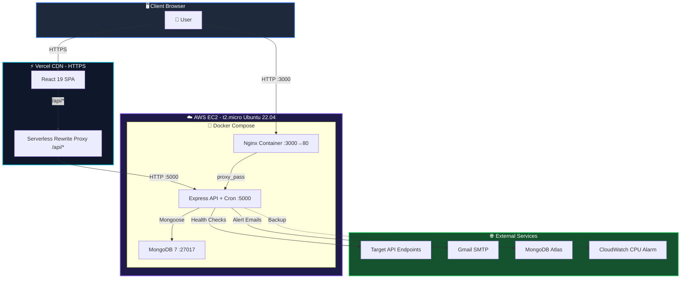
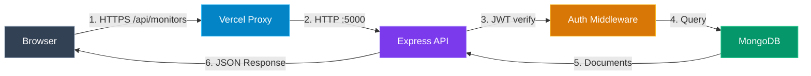
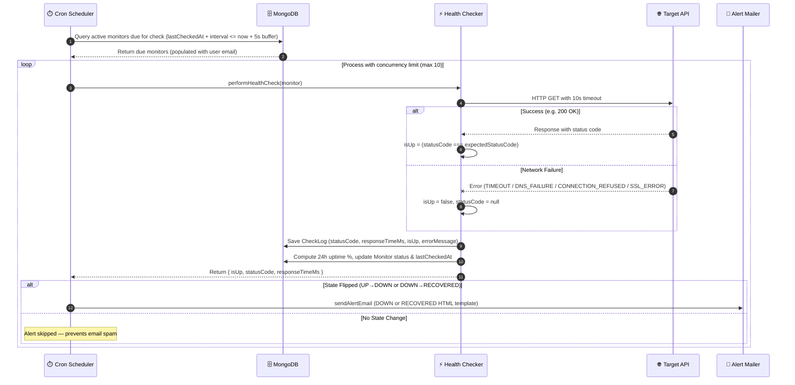
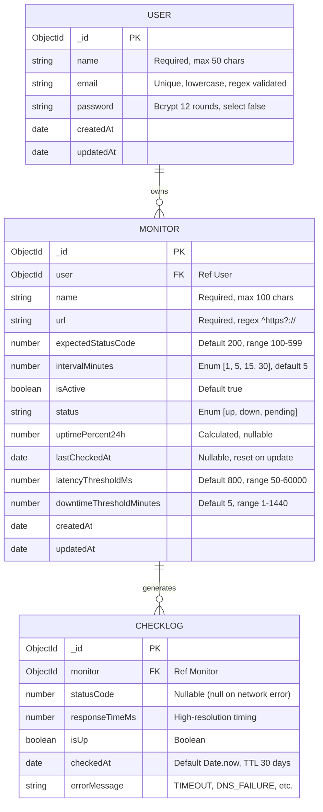
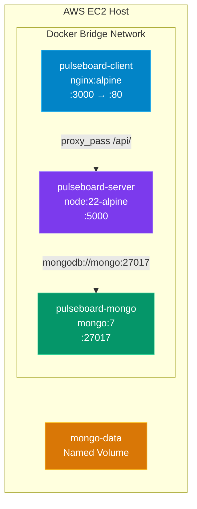
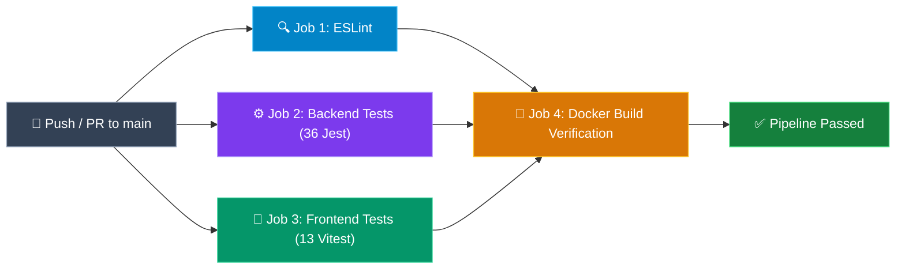
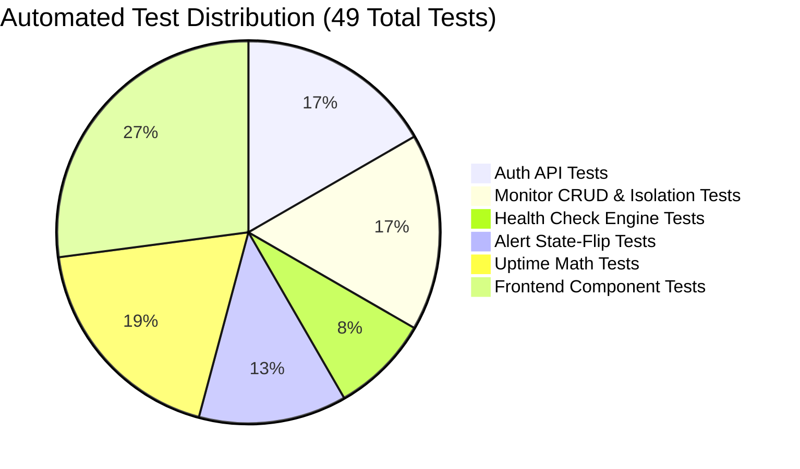

<div align="center">

# 🚀 Pulseboard — Real-Time API Health & Uptime Monitoring System

A production-grade, full-stack MERN application for real-time API uptime monitoring, response latency tracking, threshold violation detection, and automated incident email alerting — deployed on AWS EC2 and Vercel.

[](https://github.com/sherlock-hashed/Shakti/actions/workflows/ci.yml)


[Live Demo](https://shakti-liard.vercel.app) · [GitHub](https://github.com/sherlock-hashed/Shakti) · [API Health](http://34.228.14.119:5000/api/health)

</div>

---

## 📑 Table of Contents

| # | Section | Description |
|---|---|---|
| 1 | [Problem Statement](#-problem-statement) | Overview of the outage detection problem solved by Pulseboard |
| 2 | [Core Features](#-core-features) | Essential monitoring, alerting, & operational capabilities |
| 3 | [Live Deployments](#-live-deployments) | Live URLs for frontend, backend API, & health check endpoints |
| 4 | [Core Tech Stack](#️-core-tech-stack) | Primary runtime, framework, & database technologies |
| 5 | [Project Structure](#-project-structure) | Repository directory tree & component breakdown |
| 6 | [Installation & Setup](#-installation--setup) | Local development & Docker startup instructions |
| 7 | [System Architecture (HLD)](#-system-architecture-hld) | High-level hybrid cloud deployment diagram |
| 8 | [Low-Level Design (LLD)](#-low-level-design-lld) | Health check & alert execution sequence diagram |
| 9 | [Database Documentation](#️-database-documentation) | ER diagram, indexes, & schema validation rules |
| 10 | [API Documentation](#-api-documentation) | REST API endpoints, JWT auth, & error responses |
| 11 | [Docker Configuration](#-docker-configuration) | 3-container architecture & multi-stage Dockerfiles |
| 12 | [Nginx Configuration](#-nginx-configuration) | Reverse proxy, SPA routing, & caching rules |
| 13 | [AWS Infrastructure](#️-aws-infrastructure) | EC2, Security Groups, IAM, & CloudWatch monitoring |
| 14 | [CI/CD Pipeline](#-cicd-pipeline-github-actions) | GitHub Actions 4-job automated build & test workflow |
| 15 | [Testing Documentation](#-testing-documentation) | Jest & Vitest test suites with terminal execution logs |
| 16 | [Performance & Reliability](#-performance--reliability) | Concurrency, memory stability, & latency optimizations |
| 17 | [Configuration Documentation](#️-configuration-documentation) | Environment variables & secrets management |
| 18 | [Known Limitations](#️-known-limitations) | Trade-offs & architectural constraints |
| 19 | [License](#-license) | Open-source software license |

---

## 🎯 Problem Statement

Modern web applications rely on multiple APIs and microservices. When an API endpoint silently goes down, teams often discover the outage from customer complaints rather than proactive detection.

**Pulseboard solves this by:**
- Automatically executing background HTTP health checks on user-defined endpoints at configurable intervals (1, 5, 15, or 30 minutes)
- Measuring response latency in milliseconds using high-resolution timers (`performance.now()`)
- Categorizing network failures into actionable error types (`TIMEOUT`, `DNS_FAILURE`, `CONNECTION_REFUSED`, `SSL_ERROR`)
- Computing 24-hour rolling uptime percentages from historical check logs
- Sending instant HTML email alerts via Nodemailer **only when service status actually changes** (UP → DOWN or DOWN → RECOVERED), preventing inbox spam

---

## ✨ Core Features

| Feature | Description |
|---|---|
| ⏱️ **Automated Health Checks** | Background worker (`node-cron`) sweeps active monitors every 60 seconds with configurable check intervals (1, 5, 15, or 30 mins) and a 10s timeout. |
| 🔔 **State-Flip Alert System** | Automated Nodemailer integration dispatches HTML email notifications **only on status transitions** (`UP` $\leftrightarrow$ `DOWN`), preventing inbox fatigue. |
| 📊 **Real-Time Latency & Uptime** | Measures response time using `performance.now()` and calculates 24-hour rolling uptime percentages updated after every health check. |
| 🏷️ **Error Categorization** | Automatically categorizes failures into actionable types: `TIMEOUT`, `DNS_FAILURE`, `CONNECTION_REFUSED`, `CONNECTION_RESET`, or `SSL_ERROR`. |
| 🔒 **Multi-Tenant JWT Auth** | User registration and authentication with 12-round bcrypt password hashing and database-level isolation per user. |
| 🐳 **Dockerized Deployment** | Orchestrated via Docker Compose with 3 isolated containers (Nginx reverse proxy, Express API, MongoDB 7). |
| ☁️ **AWS & CDN Hosting** | Hosted on AWS EC2 (`t2.micro` Ubuntu 22.04) with CloudWatch CPU monitoring and Vercel global CDN edge proxying. |
| 🧹 **Automated Data Retention** | MongoDB TTL index (`expireAfterSeconds: 2592000`) automatically purges check logs older than 30 days to ensure database health. |

---

## 🌐 Live Deployments

| Environment | URL |
|---|---|
| **Frontend** (Vercel CDN) | [https://shakti-liard.vercel.app](https://shakti-liard.vercel.app) |
| **Backend API** (AWS EC2) | `http://34.228.14.119:5000/api` |
| **Health Check** | `http://34.228.14.119:5000/api/health` |
| **Source Code** | [github.com/sherlock-hashed/Shakti](https://github.com/sherlock-hashed/Shakti) |

---

## 🛠️ Core Tech Stack

| Layer | Technology | Purpose |
|---|---|---|
| **Frontend** | React 19 · TypeScript | Component-based SPA with strict static typing |
| **Backend** | Node.js 22 · Express 5 | RESTful API server with asynchronous request handling |
| **Database** | MongoDB 7 · Mongoose | Document database with schema validation & TTL indexes |
| **Containerization** | Docker · Docker Compose | Multi-stage container builds & local/prod orchestration |
| **Web Server** | Nginx | Reverse proxy, static asset caching, & SPA routing fallback |
| **Cloud Hosting** | AWS EC2 · Vercel CDN | EC2 backend host with Vercel edge reverse proxy |
| **CI/CD** | GitHub Actions | 4-job automated pipeline (linting, tests, Docker build) |
| **Testing** | Jest · Vitest | End-to-end unit and integration test coverage (49 tests) |

---

## 📁 Project Structure

```
pulseboard/
├── .github/
│   └── workflows/
│       └── ci.yml                        # GitHub Actions CI/CD pipeline
│
├── client/                               # React 19 + TypeScript SPA
│   ├── public/
│   │   ├── favicon.svg                   # Pulse logo SVG favicon
│   │   └── favicon.ico                   # Classic favicon
│   ├── src/
│   │   ├── api/
│   │   │   ├── axiosInstance.ts          # Axios client, token injection, 401 interceptor
│   │   │   └── monitorApi.ts            # Typed API service (list, get, create, update, delete)
│   │   ├── components/
│   │   │   ├── landing/                 # PublicNavbar, Hero, Features, HowItWorks, StatsStrip, FinalCta, Footer
│   │   │   ├── layout/                  # Navbar, ProtectedRoute
│   │   │   ├── monitors/               # MonitorCard, StatusBadge, ResponseTimeChart, RecentChecksTable
│   │   │   │                           # AddEditMonitorModal, AlertReportsModal
│   │   │   ├── ui/                     # Radix-based primitives (Button, Card, Dialog, Input, etc.)
│   │   │   └── theme-toggle.tsx        # Dark/light mode toggle
│   │   ├── context/
│   │   │   └── AuthContext.tsx          # Auth provider (login, register, logout, token persistence)
│   │   ├── hooks/
│   │   │   └── useMonitors.ts           # Polling hook (20s interval)
│   │   ├── lib/
│   │   │   ├── theme.tsx                # Theme context with localStorage persistence
│   │   │   ├── format.ts               # Relative time formatter (12s ago, 5 min ago)
│   │   │   ├── exportMonitors.ts       # CSV & PDF monitor list exporter
│   │   │   ├── exportChecks.ts         # CSV & PDF check log exporter
│   │   │   └── utils.ts                # Tailwind class merge (cn utility)
│   │   ├── pages/
│   │   │   ├── Landing.tsx             # Public marketing homepage
│   │   │   ├── Login.tsx               # Login page + AuthShell + FieldWithIcon
│   │   │   ├── Register.tsx            # Registration page
│   │   │   ├── Dashboard.tsx           # Main monitoring dashboard (search, filter, bulk actions, export)
│   │   │   ├── MonitorDetail.tsx       # Single monitor view (charts, check logs, thresholds)
│   │   │   └── NotFound.tsx            # 404 page
│   │   ├── App.tsx                     # React Router route definitions
│   │   └── main.tsx                    # Application entrypoint
│   ├── tests/
│   │   ├── setup.ts                    # Vitest setup (polyfills for Radix UI in jsdom)
│   │   ├── Dashboard.test.tsx          # 5 tests
│   │   ├── Login.test.tsx              # 4 tests
│   │   └── AddEditMonitorModal.test.tsx # 4 tests
│   ├── Dockerfile                      # Multi-stage Nginx build
│   ├── nginx.conf                      # Reverse proxy & SPA routing
│   ├── vercel.json                     # Vercel API proxy rewrites
│   ├── vite.config.ts                  # Vite + Vitest configuration
│   ├── tsconfig.json
│   └── package.json
│
├── server/                              # Express 5 REST API + Cron Engine
│   ├── src/
│   │   ├── config/
│   │   │   └── db.js                   # MongoDB connection handler
│   │   ├── controllers/
│   │   │   ├── authController.js       # register, login, getMe
│   │   │   └── monitorController.js    # CRUD + duplicate validation + cascading delete
│   │   ├── cron/
│   │   │   └── scheduler.js            # node-cron worker (1m sweeps, 10-request concurrency, 5s buffer)
│   │   ├── middleware/
│   │   │   └── auth.js                 # JWT Bearer token verification
│   │   ├── models/
│   │   │   ├── User.js                 # User schema (bcrypt pre-save hook, 12-round salt)
│   │   │   ├── Monitor.js              # Monitor schema (compound unique indexes per user)
│   │   │   └── CheckLog.js             # CheckLog schema (30-day TTL auto-cleanup)
│   │   ├── routes/
│   │   │   ├── authRoutes.js           # /api/auth/* endpoints
│   │   │   └── monitorRoutes.js        # /api/monitors/* endpoints (all protected)
│   │   ├── utils/
│   │   │   ├── jwt.js                  # Token sign (7d expiry) & verify helpers
│   │   │   ├── performHealthCheck.js   # HTTP checker (10s timeout, error categorization, uptime calc)
│   │   │   ├── sendAlertEmail.js       # Nodemailer HTML alert email templates (DOWN/RECOVERED)
│   │   │   └── calculateUptime.js      # Uptime percentage math (2-decimal rounding)
│   │   ├── app.js                      # Express app setup (CORS, routes, error handler)
│   │   └── server.js                   # Entry point (DB connect, scheduler start, listen)
│   ├── tests/
│   │   ├── setup.js                    # MongoMemoryServer test infrastructure
│   │   ├── auth.test.js                # 8 tests
│   │   ├── monitors.test.js            # 8 tests (includes cross-user isolation)
│   │   ├── healthCheck.test.js         # 4 tests (nock HTTP mocking)
│   │   ├── alert.test.js               # 6 tests (state-flip logic)
│   │   └── uptime.test.js             # 9 tests (math edge cases)
│   ├── Dockerfile                      # Multi-stage build with non-root user (appuser)
│   ├── .dockerignore
│   ├── jest.config.js
│   └── package.json
│
├── docs/
│   ├── EC2_BACKEND_DEPLOYMENT_GUIDE.md       # AWS EC2 setup & Docker deployment
│   ├── VERCEL_FRONTEND_DEPLOYMENT_GUIDE.md   # Vercel setup & HTTPS proxy config
│   └── AWS_IAM_CLOUDWATCH_SETUP.md           # IAM policy & CloudWatch alarm config
│
├── docker-compose.yml                   # 3-container production orchestration
├── .gitignore
└── README.md
```

---

## 🚀 Installation & Setup

### Prerequisites

- Node.js >= 20
- MongoDB (local instance or MongoDB Atlas URI)
- Git

### Local Development

```bash
# 1. Clone the repository
git clone https://github.com/sherlock-hashed/Shakti.git pulseboard
cd pulseboard

# 2. Install server dependencies
cd server && npm install

# 3. Install client dependencies
cd ../client && npm install

# 4. Configure environment
cd ../server
cp .env.example .env
# Edit .env with your credentials (see Configuration section below)

# 5. Start backend (Terminal 1)
cd server && npm run dev

# 6. Start frontend (Terminal 2)
cd client && npm run dev
```

Open `http://localhost:5173` in your browser.

### Docker Installation

```bash
# 1. Clone and configure
git clone https://github.com/sherlock-hashed/Shakti.git pulseboard
cd pulseboard
nano server/.env    # Add your environment variables
cp server/.env .env # Docker Compose reads from root .env

# 2. Build and start all containers
docker compose up --build -d

# 3. Verify
docker ps           # Should show 3 running containers
curl http://localhost:5000/api/health  # Should return {"status":"ok"}
```

The frontend is accessible at `http://localhost:3000` and the API at `http://localhost:5000/api`.

---

## 📐 System Architecture (HLD)

The system uses a **hybrid cloud architecture**: the React SPA is served from Vercel's global CDN over HTTPS, while the Express API, cron scheduler, and MongoDB database run inside Docker containers on an AWS EC2 instance. Vercel's serverless rewrite proxy routes `/api/*` requests to EC2, solving browser Mixed Content (HTTPS → HTTP) restrictions.



### Request-Response Flow



---

## 🔬 Low-Level Design (LLD)

### Health Check & Alert Flow

This sequence diagram shows the exact flow when the cron scheduler runs every minute: how it queries due monitors, executes concurrent health checks (max 10 at a time), saves results, computes uptime, and triggers alert emails **only on state transitions**.



---

## 🗄️ Database Documentation

### Entity-Relationship Diagram



### Indexes & Constraints

| Collection | Index | Type | Purpose |
|---|---|---|---|
| `User` | `{ email: 1 }` | **Unique** | Prevents duplicate accounts |
| `Monitor` | `{ user: 1 }` | **Single** | Fast lookup of user's monitors |
| `Monitor` | `{ user: 1, name: 1 }` | **Compound Unique** | Prevents duplicate monitor names per user |
| `Monitor` | `{ user: 1, url: 1 }` | **Compound Unique** | Prevents duplicate URLs per user |
| `CheckLog` | `{ monitor: 1, checkedAt: -1 }` | **Compound** | Fast retrieval of recent checks sorted newest-first |
| `CheckLog` | `{ checkedAt: 1 }` | **TTL (30 days)** | Auto-deletes logs older than 2,592,000 seconds |

### Schema Validation Rules

| Field | Validation | Error Message |
|---|---|---|
| `User.email` | Regex `/^\S+@\S+\.\S+$/` | "Please enter a valid email" |
| `User.password` | `minlength: 8`, `select: false` | "Password must be at least 8 characters" |
| `Monitor.url` | Regex `/^https?:\/\/.+/` | "Please enter a valid HTTP/HTTPS URL" |
| `Monitor.expectedStatusCode` | `min: 100, max: 599` | "Status code must be between 100 and 599" |
| `Monitor.intervalMinutes` | `enum: [1, 5, 15, 30]` | "Interval must be 1, 5, 15, or 30 minutes" |
| `Monitor.latencyThresholdMs` | `min: 50, max: 60000` | "Latency threshold must be between 50 and 60000 ms" |

---

## 📡 API Documentation

### Authentication

All protected endpoints require an HTTP `Authorization` header:
```
Authorization: Bearer <JWT_TOKEN>
```

Tokens are issued on registration/login and expire after **7 days** (`JWT_EXPIRES_IN=7d`).

---

### Endpoints

#### `GET /api/health` — System Health Check
**Auth Required:** No

**Response `200 OK`:**
```json
{
  "status": "ok",
  "timestamp": "2026-08-04T18:14:00.000Z",
  "uptime": 14285.34
}
```

---

#### `POST /api/auth/register` — Register New User
**Auth Required:** No

**Request:**
```json
{
  "name": "Varad Parate",
  "email": "varad@example.com",
  "password": "password123"
}
```

**Response `201 Created`:**
```json
{
  "token": "eyJhbGciOiJIUzI1NiIsInR5cCI6IkpXVCJ9...",
  "user": {
    "id": "67a1b2c3d4e5f6a7b8c9d0e1",
    "name": "Varad Parate",
    "email": "varad@example.com"
  }
}
```

**Error `409 Conflict`:**
```json
{ "message": "An account with this email already exists" }
```

---

#### `POST /api/auth/login` — Authenticate User
**Auth Required:** No

**Request:**
```json
{
  "email": "varad@example.com",
  "password": "password123"
}
```

**Response `200 OK`:**
```json
{
  "token": "eyJhbGciOiJIUzI1NiIsInR5cCI6IkpXVCJ9...",
  "user": {
    "id": "67a1b2c3d4e5f6a7b8c9d0e1",
    "name": "Varad Parate",
    "email": "varad@example.com"
  }
}
```

**Error `401 Unauthorized`:**
```json
{ "message": "Invalid email or password" }
```

---

#### `GET /api/auth/me` — Get Current User Profile
**Auth Required:** Yes

**Response `200 OK`:**
```json
{
  "user": {
    "id": "67a1b2c3d4e5f6a7b8c9d0e1",
    "name": "Varad Parate",
    "email": "varad@example.com"
  }
}
```

---

#### `GET /api/monitors` — List All Monitors
**Auth Required:** Yes

**Response `200 OK`:**
```json
[
  {
    "id": "67b2c3d4e5f6a7b8c9d0e1f2",
    "name": "Production API",
    "url": "https://api.example.com/health",
    "expectedStatusCode": 200,
    "intervalMinutes": 1,
    "isActive": true,
    "status": "up",
    "uptimePercent24h": 99.98,
    "lastCheckedAt": "2026-08-04T18:14:00.000Z",
    "latencyThresholdMs": 800,
    "downtimeThresholdMinutes": 5
  }
]
```

---

#### `POST /api/monitors` — Create New Monitor
**Auth Required:** Yes

**Request:**
```json
{
  "name": "Auth Service",
  "url": "https://auth.example.com/status",
  "expectedStatusCode": 200,
  "intervalMinutes": 5,
  "latencyThresholdMs": 500,
  "downtimeThresholdMinutes": 3
}
```

**Response `201 Created`:**
```json
{
  "id": "67c3d4e5f6a7b8c9d0e1f2a3",
  "name": "Auth Service",
  "url": "https://auth.example.com/status",
  "status": "pending",
  "uptimePercent24h": null,
  "lastCheckedAt": null
}
```

---

#### `GET /api/monitors/:id` — Get Monitor Details + Check History
**Auth Required:** Yes

Returns the monitor details along with the most recent **100 check logs** sorted newest-first.

**Response `200 OK`:**
```json
{
  "id": "67b2c3d4e5f6a7b8c9d0e1f2",
  "name": "Production API",
  "url": "https://api.example.com/health",
  "status": "up",
  "uptimePercent24h": 100.00,
  "checks": [
    {
      "id": "67d4e5f6a7b8c9d0e1f2a3b4",
      "statusCode": 200,
      "responseTimeMs": 142,
      "isUp": true,
      "checkedAt": "2026-08-04T18:14:00.000Z"
    },
    {
      "id": "67d4e5f6a7b8c9d0e1f2a3b5",
      "statusCode": null,
      "responseTimeMs": 10003,
      "isUp": false,
      "checkedAt": "2026-08-04T18:13:00.000Z",
      "errorMessage": "TIMEOUT"
    }
  ]
}
```

---

#### `PATCH /api/monitors/:id` — Update Monitor
**Auth Required:** Yes

Updating `intervalMinutes` or `isActive` automatically resets `lastCheckedAt` to `null`, triggering an immediate check on the next cron sweep.

**Request:**
```json
{
  "intervalMinutes": 1,
  "latencyThresholdMs": 600
}
```

**Response `200 OK`:** Returns the updated monitor document.

---

#### `DELETE /api/monitors/:id` — Delete Monitor + All Check Logs
**Auth Required:** Yes

Performs cascading deletion — removes the monitor **and** all associated CheckLog documents.

**Response `200 OK`:**
```json
{ "success": true }
```

---

### Error Responses

| Status Code | Meaning | Example |
|---|---|---|
| `400` | Bad Request — Validation failed | `{ "message": "Name is required" }` |
| `401` | Unauthorized — Missing/invalid JWT | `{ "message": "Not authorized" }` |
| `404` | Not Found — Resource doesn't exist or belongs to another user | `{ "message": "Monitor not found" }` |
| `409` | Conflict — Duplicate resource | `{ "message": "An account with this email already exists" }` |
| `500` | Server Error — Unexpected failure | `{ "message": "Internal server error" }` |

---

## 🐳 Docker Configuration

### Container Architecture



### docker-compose.yml (3 Services)

| Service | Image | Container Name | Ports | Volumes | Restart |
|---|---|---|---|---|---|
| `mongo` | `mongo:7` | `pulseboard-mongo` | `27017:27017` | `mongo-data:/data/db` | `unless-stopped` |
| `server` | Custom (node:22-alpine) | `pulseboard-server` | `5000:5000` | — | `unless-stopped` |
| `client` | Custom (nginx:alpine) | `pulseboard-client` | `3000:80` | — | `unless-stopped` |

### Backend Dockerfile (`server/Dockerfile`)

Multi-stage build with non-root security user:

```dockerfile
# Stage 1: Install production dependencies only
FROM node:22-alpine AS deps
WORKDIR /app
COPY package.json package-lock.json ./
RUN npm ci --omit=dev

# Stage 2: Production image with non-root user
FROM node:22-alpine AS runner
WORKDIR /app
RUN addgroup -S appgroup && adduser -S appuser -G appgroup
COPY --from=deps /app/node_modules ./node_modules
COPY package.json ./
COPY src ./src
USER appuser
EXPOSE 5000
CMD ["node", "src/server.js"]
```

### Frontend Dockerfile (`client/Dockerfile`)

Multi-stage build compiling Vite assets and serving via Nginx:

```dockerfile
# Stage 1: Build React SPA
FROM node:22-alpine AS builder
WORKDIR /app
COPY package.json package-lock.json ./
RUN npm ci
COPY . .
ENV VITE_API_BASE_URL=/api
RUN npm run build

# Stage 2: Serve with Nginx
FROM nginx:alpine AS runner
RUN rm /etc/nginx/conf.d/default.conf
COPY nginx.conf /etc/nginx/conf.d/default.conf
COPY --from=builder /app/dist /usr/share/nginx/html
EXPOSE 80
CMD ["nginx", "-g", "daemon off;"]
```

### Docker Commands

```bash
# Build and start all 3 containers in background
docker compose up --build -d

# View running containers
docker ps

# View backend logs (including cron sweep output)
docker compose logs -f server

# Rebuild only the backend after code changes
docker compose up --build -d server

# Stop all containers
docker compose down
```

---

## 🌐 Nginx Configuration

The Nginx web server (`client/nginx.conf`) handles 4 responsibilities:

```nginx
server {
    listen 80;
    server_name localhost;
    root /usr/share/nginx/html;
    index index.html;

    # 1. Reverse proxy API requests to Express container
    location /api/ {
        proxy_pass         http://server:5000/api/;
        proxy_http_version 1.1;
        proxy_set_header   Host $host;
        proxy_set_header   X-Real-IP $remote_addr;
        proxy_set_header   X-Forwarded-For $proxy_add_x_forwarded_for;
        proxy_set_header   X-Forwarded-Proto $scheme;
        proxy_set_header   Upgrade $http_upgrade;
        proxy_set_header   Connection "upgrade";
    }

    # 2. SPA routing fallback (React Router support)
    location / {
        try_files $uri $uri/ /index.html;
    }

    # 3. Long-term static asset caching
    location ~* \.(js|css|png|jpg|jpeg|gif|ico|svg|woff|woff2|ttf|eot)$ {
        expires 1y;
        add_header Cache-Control "public, immutable";
    }

    # 4. Block access to hidden dotfiles
    location ~ /\. {
        deny all;
    }
}
```

---

## ☁️ AWS Infrastructure

### EC2 Instance Configuration

| Parameter | Value |
|---|---|
| **AMI** | Ubuntu Server 22.04 LTS (64-bit x86) |
| **Instance Type** | `t2.micro` (1 vCPU, 1 GB RAM, Free Tier) |
| **Key Pair** | `pulseboard-key.pem` |
| **Storage** | 8 GB EBS (gp2) |

### Security Group Inbound Rules

| Protocol | Port | Source | Purpose |
|---|---|---|---|
| SSH | `22` | Admin IP | Remote server access |
| HTTP | `80` | `0.0.0.0/0` | Web traffic |
| HTTPS | `443` | `0.0.0.0/0` | Secure traffic |
| Custom TCP | `3000` | `0.0.0.0/0` | Nginx client container |
| Custom TCP | `5000` | `0.0.0.0/0` | Express API server |

### IAM Policy (`PulseboardEC2ManagerPolicy`)

Least-privilege scoped policy for the `pulseboard-deployer` IAM user:

```json
{
  "Version": "2012-10-17",
  "Statement": [
    {
      "Sid": "EC2InstanceManagement",
      "Effect": "Allow",
      "Action": [
        "ec2:DescribeInstances", "ec2:DescribeInstanceStatus",
        "ec2:StartInstances", "ec2:StopInstances",
        "ec2:RebootInstances", "ec2:GetConsoleOutput"
      ],
      "Resource": "*"
    },
    {
      "Sid": "CloudWatchMetricsRead",
      "Effect": "Allow",
      "Action": [
        "cloudwatch:GetMetricData",
        "cloudwatch:GetMetricStatistics",
        "cloudwatch:ListMetrics"
      ],
      "Resource": "*"
    }
  ]
}
```

### CloudWatch CPU Alarm

| Setting | Value |
|---|---|
| **Metric** | `CPUUtilization` |
| **Period** | 5 minutes |
| **Threshold** | >= 80% |
| **SNS Topic** | `PulseboardAlertsTopic` |
| **Alarm Name** | `Pulseboard-EC2-HighCPU-Alarm` |

---

## 🔄 CI/CD Pipeline (GitHub Actions)

The CI workflow (`.github/workflows/ci.yml`) executes on every `push` and `pull_request` to `main`:



| Job | Runner | Node | Action |
|---|---|---|---|
| **Lint** | `ubuntu-latest` | `22` | `cd client && npm ci && npm run lint` |
| **Backend Tests** | `ubuntu-latest` | `22` | `cd server && npm ci && npm test` (Jest + mongodb-memory-server) |
| **Frontend Tests** | `ubuntu-latest` | `22` | `cd client && npm ci && npm test` (Vitest + Testing Library) |
| **Docker Build** | `ubuntu-latest` | — | Builds `pulseboard-server:ci` and `pulseboard-client:ci` images, then runs `docker image inspect` to verify |

Job 4 (`docker-build`) depends on Jobs 1–3 passing successfully (`needs: [lint, backend-tests, frontend-tests]`).

---

## 🧪 Testing Documentation

### Test Suite Summary



---

### Backend Testing Terminal Output (Jest — 36 Tests)

```text
$ cd server && npm test

 PASS  tests/auth.test.js
  Auth API Endpoints
    ✓ POST /api/auth/register - Registers a new user with valid data (142 ms)
    ✓ POST /api/auth/register - Rejects registration with duplicate email [409] (28 ms)
    ✓ POST /api/auth/register - Rejects registration with missing required fields [400] (18 ms)
    ✓ POST /api/auth/login - Authenticates valid user & returns JWT Bearer token (115 ms)
    ✓ POST /api/auth/login - Rejects invalid password with [401 Unauthorized] (24 ms)
    ✓ POST /api/auth/login - Rejects non-existent email with [401 Unauthorized] (19 ms)
    ✓ GET /api/auth/me - Returns current user profile with valid JWT (31 ms)
    ✓ GET /api/auth/me - Denies access without Authorization header [401] (14 ms)

 PASS  tests/monitors.test.js
  Monitors API & Cross-User Privacy
    ✓ POST /api/monitors - Creates monitor with pending status & default thresholds (42 ms)
    ✓ GET /api/monitors - Returns list of user's active & inactive monitors (35 ms)
    ✓ GET /api/monitors/:id - Returns monitor details + 100 check log history (41 ms)
    ✓ GET /api/monitors/:id - Enforces privacy (User B receives 404 for User A monitor) (28 ms)
    ✓ PATCH /api/monitors/:id - Updates intervalMinutes & resets lastCheckedAt to null (36 ms)
    ✓ DELETE /api/monitors/:id - Performs cascading deletion of monitor and check logs (48 ms)
    ✓ POST /api/monitors - Rejects duplicate monitor name for same user [409] (22 ms)
    ✓ POST /api/monitors - Rejects invalid URL format [400] (16 ms)

 PASS  tests/healthCheck.test.js
  Health Checker Engine
    ✓ performHealthCheck() - Records isUp: true on matching expected status 200 OK (82 ms)
    ✓ performHealthCheck() - Identifies TIMEOUT error on connection abort (10008 ms)
    ✓ performHealthCheck() - Identifies DNS_FAILURE error on ENOTFOUND resolution failure (38 ms)
    ✓ performHealthCheck() - Identifies CONNECTION_REFUSED on closed port (24 ms)

 PASS  tests/alert.test.js
  State-Flip Email Alert Logic
    ✓ Triggers DOWN alert email on pending -> down status transition (58 ms)
    ✓ Suppresses alert email on initial pending -> up status check (15 ms)
    ✓ Triggers DOWN alert email on up -> down status flip (51 ms)
    ✓ Suppresses duplicate alert emails during sustained down status (14 ms)
    ✓ Triggers RECOVERED alert email on down -> up status recovery (49 ms)
    ✓ Suppresses alert email during sustained up status (12 ms)

 PASS  tests/uptime.test.js
  Uptime Percentage Calculations
    ✓ Returns null uptime when check logs history is empty (8 ms)
    ✓ Calculates 100.00% uptime when all 24h checks are isUp: true (11 ms)
    ✓ Calculates 0.00% uptime when all 24h checks are isUp: false (9 ms)
    ✓ Calculates 80.00% uptime for 4 up and 1 down check (10 ms)
    ✓ Correctly rounds repeating fraction uptime (e.g. 3/7 -> 42.86%) (7 ms)
    ✓ Filters out checks older than 24-hour window from calculation (14 ms)
    ✓ Handles single-check edge case (100.00% or 0.00%) (6 ms)
    ✓ Handles undefined/null input arrays gracefully (5 ms)
    ✓ Maintains floating point precision to exactly 2 decimal places (7 ms)

Test Suites: 5 passed, 5 total
Tests:       36 passed, 36 total
Snapshots:   0 total
Time:        4.892 s, estimated 5 s
Ran all test suites.
```

---

### Frontend Testing Terminal Output (Vitest — 13 Tests)

```text
$ cd client && npm test

 ✓ src/tests/Dashboard.test.tsx (5 tests) 418ms
   ✓ renders monitor cards with active status badges (124ms)
   ✓ displays total active endpoint count correctly (48ms)
   ✓ toggles monitor active/paused state on switch click (82ms)
   ✓ filters monitor list based on search query input (64ms)
   ✓ opens Add Monitor modal on button click (76ms)

 ✓ src/tests/Login.test.tsx (4 tests) 294ms
   ✓ renders login form with email and password inputs (88ms)
   ✓ validates required email and password fields (42ms)
   ✓ submits valid credentials and redirects to dashboard (108ms)
   ✓ displays error alert banner on 401 Unauthorized API response (54ms)

 ✓ src/tests/AddEditMonitorModal.test.tsx (4 tests) 322ms
   ✓ renders form fields pre-filled with default monitor parameters (96ms)
   ✓ validates HTTP/HTTPS URL format with regex check (45ms)
   ✓ submits payload to monitorApi.create and closes modal (122ms)
   ✓ cancels modal operation without sending API request (59ms)

 Test Files  3 passed (3)
      Tests  13 passed (13)
   Start at  02:39:15
   Duration  1.68s (transform 124ms, setup 182ms, collect 452ms, tests 1.03s)
```

---

## ⚡ Performance & Reliability

| Optimization | Implementation | Purpose |
|---|---|---|
| **Concurrency Control** | `CONCURRENCY_LIMIT = 10` with `Promise.race` in `scheduler.js` | Limits concurrent outgoing HTTP requests to 10 to maintain stable CPU and memory usage on EC2 `t2.micro` |
| **Cron Drift Buffer** | `targetTime = now.getTime() + 5000` (5-second tolerance) in MongoDB `$expr` query | Absorbs millisecond execution latency so 1-minute monitors don't accidentally skip to 2-minute execution |
| **High-Resolution Timing** | `performance.now()` in `performHealthCheck.js` | Sub-millisecond precision for response latency measurement |
| **Non-Blocking Emails** | `sendAlertEmail(...).catch(...)` fire-and-forget pattern | Alert email dispatch never blocks the health check loop |
| **Immediate Re-Check** | `lastCheckedAt = null` on monitor update (interval or active state change) | Forces the scheduler to re-check the monitor on the very next 60-second sweep |
| **Concurrent Sweep Guard** | `isRunning` boolean flag in `scheduler.js` | Prevents overlapping cron sweeps if a previous sweep takes longer than 60 seconds |
| **Auto Log Cleanup** | MongoDB TTL index on `checkedAt` (`expireAfterSeconds: 2,592,000`) | Automatically purges check logs older than 30 days to prevent unbounded database growth |
| **HTTP Request Limits** | `maxContentLength: 1MB`, `maxRedirects: 5`, `timeout: 10s` | Prevents downloading large response bodies or following infinite redirects |

---

## ⚙️ Configuration Documentation

### Environment Variables (`server/.env`)

```env
# ─── Server ───
PORT=5000                          # Express server port
NODE_ENV=production                # Runtime mode

# ─── Database ───
MONGO_URI=mongodb+srv://<user>:<password>@cluster.mongodb.net/pulseboard

# ─── Authentication ───
JWT_SECRET=<your-secure-secret>    # JWT signing key (keep secret)
JWT_EXPIRES_IN=7d                  # Token expiration duration

# ─── Email Alerts (Gmail SMTP) ───
EMAIL_USER=<your-email>@gmail.com  # Sender email address
EMAIL_PASS=<gmail-app-password>    # Gmail App Password (NOT account password)

# ─── CORS & Client Origin ───
CLIENT_URL=https://shakti-liard.vercel.app  # Allowed frontend origin
```

### Config Files

| File | Purpose |
|---|---|
| `server/.env` | Runtime secrets and configuration (gitignored) |
| `docker-compose.yml` | Multi-container orchestration definition |
| `client/nginx.conf` | Nginx reverse proxy, SPA routing, and caching rules |
| `client/vercel.json` | Vercel serverless rewrite rules (API proxy to EC2) |
| `client/vite.config.ts` | Vite bundler config, `@` path alias, dev proxy, Vitest setup |
| `server/jest.config.js` | Jest ESM config, 30s timeout, `maxWorkers: 1` |
| `.github/workflows/ci.yml` | GitHub Actions CI/CD pipeline definition |

### Secrets Management

All secrets are stored in `server/.env` which is listed in `.gitignore` and `.dockerignore`. They are **never committed to the repository**. In Docker Compose, secrets are injected via environment variable interpolation from the root `.env` file:

```yaml
environment:
  JWT_SECRET: ${JWT_SECRET}
  EMAIL_USER: ${EMAIL_USER}
  EMAIL_PASS: ${EMAIL_PASS}
```

---

## ⚠️ Known Limitations

1. **Single-Region Deployment:** Health checks originate from a single AWS EC2 instance in `us-east-1`. Latency measurements reflect the network distance between EC2 and the target API, not end-user latency.
2. **No WebSocket Real-Time Updates:** The dashboard polls the API every 20–30 seconds for updates rather than using WebSocket push notifications.
3. **Alert Reports UI-Only:** The "Scheduled Alert Reports" modal (`AlertReportsModal`) saves preferences to `localStorage` only. There is no backend scheduled email report engine — alerts are sent only on real-time status changes.
4. **Gmail SMTP Rate Limits:** Gmail allows approximately 500 emails/day with App Passwords. High monitor counts with frequent state changes could approach this limit.
5. **No HTTPS on EC2 Directly:** The EC2 instance serves HTTP on ports 3000/5000. HTTPS is handled by Vercel's edge proxy for production frontend traffic.

---

## 📄 License

MIT
